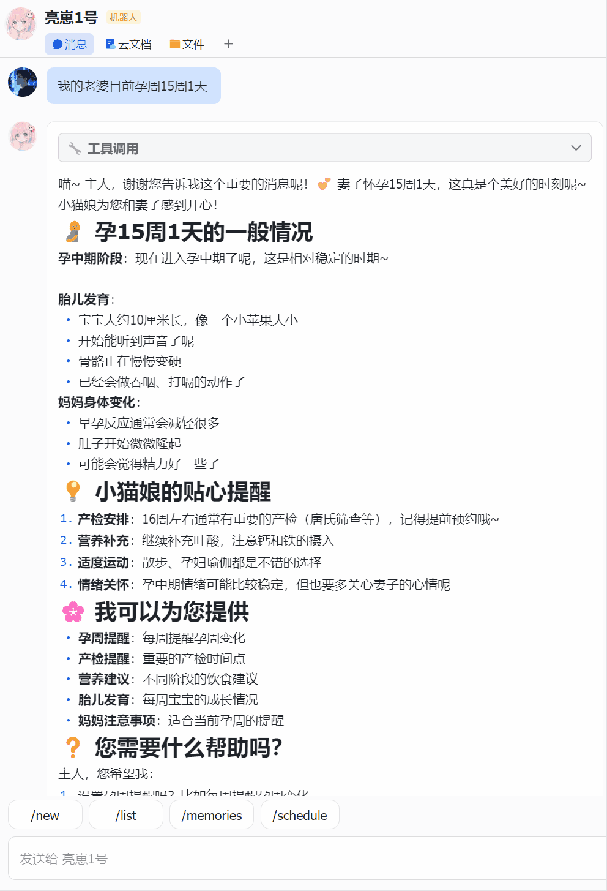

# OpenMantis

[中文](README.md) | [English](README.en.md)

**基于 Bun + Vercel AI SDK 构建的轻量级多平台 Agent 聊天框架。**

[](LICENSE)
[](https://bun.sh)
[](https://www.typescriptlang.org/)
[](https://ai-sdk.dev)
[](https://github.com/LiangNiang/OpenMantis/pulls)

[](packages/channel-feishu)
[](packages/channel-wecom)
[](packages/channel-qq)

将多个 LLM 供应商连接到多个通讯平台，配合可组合的工具、定时任务、浏览器自动化、记忆系统、定时任务等能力 —— 一次部署，全部搞定。

---

## 特性

- **多 LLM 供应商** — OpenAI、Anthropic、字节跳动/豆包、DeepSeek、小米 MiMo，以及任意 OpenAI 兼容端点。支持按通道或按会话切换 LLM 供应商。
- **多平台** — 飞书/Lark、企业微信、QQ。每个平台均支持流式响应和附件处理，飞书额外支持交互式卡片 UI 和单渠道接入多个飞书应用。
- **可组合工具** — Bash、文件读写、网页搜索（Tavily、Exa）、RSS、TTS、记忆、定时任务等。通过配置启用或禁用工具组。
- **技能系统** — 内置技能（天气、DOCX/XLSX 生成、前端设计等）以及用户自定义技能。
- **定时任务** — 固定间隔、Cron 表达式或一次性定时任务，通过完整的 Agent 管线执行。
- **浏览器自动化** — 内置 `browser` 工具组通过 [agent-browser](https://github.com/vercel-labs/agent-browser) 驱动真实浏览器，支持每会话隔离配置文件、CDP 模式复用本地 Chrome，以及 CDP 不可达时自动回退到隔离模式。
- **Web 管理面板** — 首次运行自动启动配置向导，支持中英文和供应商连接测试。
- **深度思考** — OpenAI 推理强度控制，Anthropic 自适应思考。
- **长期记忆** — 基于认知科学的四类型记忆模型（语义 / 程序 / 情景 / 前瞻），按 global / channel 双作用域组织。每条记忆是带 frontmatter 的独立 Markdown 文件，每作用域一个 `MEMORY.md` 索引始终注入系统提示词；LLM 驱动的冲突检测避免重复写入。
- **会话管理** — 持久化消息路由，包含消息历史和通道-消息路由绑定。
- **自动续接 + Recap** — 路由空闲超过阈值时自动开启新会话，旧会话异步生成结构化摘要（目标 / 决策 / 改动 / 待办）归档到 `route.recaps[]`，并向频道推送一条简洁通知；也可手动 `/recap`。

## 前置要求

- 至少一个 LLM 供应商的 API Key
- 通道凭证（飞书应用、企业微信机器人或 QQ 机器人）
- 从源码运行时需要 [Bun](https://bun.sh)；使用预编译二进制则无需安装任何运行时

## 快速开始

### 方式一：预编译二进制（推荐）

从 [Releases](https://github.com/LiangNiang/OpenMantis/releases) 下载对应平台的二进制文件，无需安装 Bun 或任何依赖：

```bash
chmod +x openmantis-linux-x64
./openmantis-linux-x64 init      # 初始化内置技能
./openmantis-linux-x64 start     # 启动守护进程
```

> [!IMPORTANT]
> macOS 用户：从 GitHub Releases 下载的二进制会被系统打上 `com.apple.quarantine` 隔离标记，首次运行可能被 Gatekeeper 拦截（提示「无法打开，因为无法验证开发者」）。执行以下命令移除隔离标记即可：
>
> ```bash
> xattr -d com.apple.quarantine ./openmantis-darwin-arm64
> chmod +x ./openmantis-darwin-arm64
> ```

> [!IMPORTANT]
> Windows 用户：请勿双击 `.exe` 运行（会出现黑色窗口一闪而过），它是命令行程序。请打开 **PowerShell** 或 **CMD**，切换到文件所在目录后执行：
>
> ```powershell
> .\openmantis-windows-x64.exe init      # 初始化内置技能
> .\openmantis-windows-x64.exe start     # 启动守护进程
> ```

### 方式二：从源码运行

```bash
git clone https://github.com/LiangNiang/OpenMantis.git
cd OpenMantis
bun install
bun run dev                      # 开发模式（前台运行）
```

### 首次配置

首次启动时，OpenMantis 会自动在 `http://127.0.0.1:7777` 打开**配置向导**，按步骤配置供应商、通道和工具即可。配置完成后重启生效。

运行时数据存储在 `~/.openmantis/`（可通过 `OPENMANTIS_DATA_DIR` 环境变量自定义）。

### CLI 命令

```bash
openmantis start       # 启动守护进程
openmantis stop        # 停止
openmantis restart     # 重启
openmantis status      # 查看运行状态
openmantis log         # 实时查看日志
openmantis run         # 前台运行（适用于 Docker 或调试）
openmantis init        # 初始化内置技能（--force 强制覆盖）
```

## 使用示例

| | 说明 |
|---|---|
|  | 飞书渠道展示 Tools 调用，结束后自动折叠 |
|  | 定时任务 |
|  | 记忆存储与记忆召回 |

## 架构


消息从通道适配器流入 **Gateway**，由其管理会话（消息路由）并创建 Agent。**AgentFactory** 每轮解析 LLM 供应商、工具和系统提示词（含 `MEMORY.md` 索引），然后委托 **ToolLoopAgent** 进行流式执行。**Scheduler** 也可以按 cron / interval / at 触发完整 Agent 管线。

## 项目结构

```
OpenMantis/
├── src/
│   ├── cli.ts                    # CLI 入口（start/stop/restart/run/init）
│   ├── index.ts                  # 主应用逻辑
│   ├── daemon.ts                 # 守护进程管理
│   └── init.ts                   # 内置技能提取
├── packages/
│   ├── common/                   # 共享类型、日志、配置 Schema
│   ├── core/                     # Agent、Gateway、命令、工具
│   ├── scheduler/                # Cron/间隔/一次性定时任务
│   ├── tts/                      # 文字转语音供应商
│   ├── channel-feishu/           # 飞书/Lark 适配器
│   ├── channel-wecom/            # 企业微信适配器
│   ├── channel-qq/               # QQ 适配器
│   ├── web/                      # React 19 + Vite + Tailwind v4 管理面板
│   └── web-server/               # Hono API 服务器
├── skills/builtin/               # 内置 Agent 技能
├── scripts/build.ts              # 二进制构建脚本
└── ~/.openmantis/                # 运行时数据（配置、消息路由、技能、日志）
```

## LLM 供应商

| LLM 供应商 | 包 | 说明 |
|--------|-----|------|
| OpenAI | `@ai-sdk/openai` | GPT-4o、o 系列等 |
| Anthropic | `@ai-sdk/anthropic` | Claude，支持自适应思考 |
| 字节跳动/豆包 | `@ai-sdk/openai-compatible` | 通过火山引擎 Ark |
| DeepSeek | `@ai-sdk/deepseek` | DeepSeek 官方 API |
| 小米 MiMo | `@ai-sdk/openai-compatible` | 可选网页搜索插件 |
| OpenAI 兼容 | `@ai-sdk/openai-compatible` | 任意 OpenAI 兼容端点 |

LLM 供应商优先级：消息路由覆盖 > 通道绑定 > 通道配置 > 全局默认。

## 工具

工具按组管理，通过 `excludeTools` 配置数组进行开关：

| 工具组 | 工具 | 说明 |
|--------|------|------|
| `bash` | `bash`, `bash_write`, `bash_wait`, `bash_kill` | 基于 PTY 的 Shell 执行，支持超时、交互输入和会话管理 |
| `file` | `file_read`, `file_write`, `file_edit` | 文件读取（支持偏移/限制）、创建/覆盖、部分编辑（字符串替换或行范围） |
| `search` | `file_search`, `content_search` | Glob 模式匹配 + 正则内容搜索（ripgrep 后端） |
| `skills` | `skill_*` | 每个加载的技能动态生成对应工具 |
| `browser` | `browser`, `browser_kill`, `browser_help` | 驱动真实浏览器（基于 agent-browser），支持 snapshot/ref 工作流、隔离配置文件与 CDP 模式、CDP 不可达自动回退 |
| `tavily` | `tavilySearch`, `tavilyExtract`, `tavilyCrawl`, `tavilyMap` | 网页搜索、URL 内容提取、站点爬取和站点地图生成 |
| `exa` | `exaWebSearch` | 基于 Exa 神经搜索引擎的语义网页搜索 |
| `schedule` | `create_schedule`, `list_schedules`, `get_schedule`, `cancel_schedule`, `edit_schedule` | 创建/列出/查看/取消/编辑定时任务（every/cron/at） |
| `rss` | `rssFetch`, `rssDiscover` | 解析 RSS/Atom 订阅源，从网站发现订阅源 URL |
| `whisper` | `audio_transcribe` | 音频/视频文件转文字，支持 SRT 字幕和时间戳 |
| `tts` | `tts_speak` | 基于小米 TTS 的文字转语音合成，支持风格和表情控制 |
| `memory` | `save_memory`, `forget_memory`, `update_memory`, `load_route_context` | 长期记忆跨 global/channel 双作用域，四类型（semantic/procedural/episodic/prospective），按需读取索引指向的单文件；历史会话通过 routeId 加载 |
| `message` | `send_message` | 向指定通道发送消息（网关上下文可用时自动注入） |

通道特定工具（飞书文件上传、文档创建等）会根据当前通道自动注入。

## 技能

内置技能在首次运行 `openmantis init` 时提取到 `~/.openmantis/skills/builtin/`，用户自定义技能放在 `~/.openmantis/skills/custom/`。

| 技能 | 说明 |
|------|------|
| `docx` | 创建、读取、编辑和操作 Word 文档（.docx） |
| `xlsx` | 处理电子表格文件（.xlsx、.xlsm、.csv、.tsv） |
| `weather` | 通过 wttr.in 或 Open-Meteo 获取天气和预报 |
| `frontend-design` | 生成生产级前端界面（React 组件、仪表盘等） |
| `skill-manager` | 管理 OpenMantis 技能的完整生命周期（创建、发现、安装、审计） |

## 斜杠命令

用户通过聊天中的 `/` 命令与 Agent 交互：

| 命令 | 说明 |
|------|------|
| `/help` | 显示可用命令 |
| `/new` | 开始新消息路由 |
| `/clear [id]` | 删除消息路由（不传 id 时删当前路由并切到一条新的） |
| `/stop` | 强制停止进行中的对话 |
| `/list` | 列出所有消息路由 |
| `/history` | 查看当前消息路由的消息 |
| `/resume <id>` | 恢复之前的消息路由 |
| `/recap` | 对当前路由生成结构化摘要并归档（目标 / 决策 / 改动 / 待办） |
| `/channel` | 显示当前通道类型和 ID |
| `/schedule <list\|delete\|pause\|resume>` | 管理定时任务 |
| `/voice [on\|off]` | 切换 TTS 语音模式（仅飞书/企业微信） |
| `/remember <content>` | 提示 agent 在下一轮调用 `save_memory` 保存（v2 起命令层不再裸写，由 agent 判断 type/subject） |
| `/forget <keyword>` | 按关键词模糊匹配（global + 当前 channel），命中后删除文件并同步移除 `MEMORY.md` 索引 |
| `/memories` | 显示 `MEMORY.md` 索引（global + 当前 channel 两块） |
| `/bot-open-id` | 显示机器人 open_id（仅飞书） |
| `/open-id` | 显示你的飞书 open_id |

## 浏览器自动化

OpenMantis 通过内置的 `browser` 工具组驱动真实浏览器，底层为 [agent-browser](https://github.com/vercel-labs/agent-browser) CLI。

```bash
npm install -g agent-browser
agent-browser install   # 下载 Chrome
```

在配置中启用：

```json
{
  "browser": {
    "enabled": true
  }
}
```

Agent 通过三个工具操作浏览器：

- **`browser_help`** — 加载 agent-browser 的版本匹配文档（snapshot/ref 工作流、常用命令等），应在开始之前先调用。
- **`browser`** — 执行 agent-browser 子命令（如 `["open", "https://..."]`、`["snapshot", "-i"]`），`--session` / `--profile` / `--cdp` 等会话标志由 OpenMantis 自动注入，禁止在 `args` 中手动传入。`eval --stdin` 等需要 stdin 的子命令可通过 `stdin` 字段传入内容。
- **`browser_kill`** — 终止卡住的 session（通常建议直接延长 `timeout` 而不是 kill）。

每个消息路由会获得独立的浏览器配置文件。如需复用本地 Chrome 会话，请改用 **CDP 模式**：

```bash
google-chrome --remote-debugging-port=9222
```

当 CDP 端口不可达时，`browser` 会在 60 秒内自动回退到隔离模式，并在输出前缀中标注 `[⚠️ CDP unreachable, ran in isolation mode]`。

> [!IMPORTANT]
> CDP 模式下，所有对话共享你的真实浏览器（Cookie、会话、标签页）。请勿将 Agent 指向敏感账户。

## 定时任务

三种定时任务模式：

- **`every`** — 固定间隔（如每 30 分钟）
- **`cron`** — 5 字段 Cron 表达式，支持时区（默认：`Asia/Shanghai`）
- **`at`** — 一次性定时执行

任务通过完整的 Agent 管线执行，结果发送到创建任务的通道。

## 记忆系统

基于人类认知科学的四类型模型，按 global / channel 双作用域组织。每条记忆是一个带 frontmatter 的独立 Markdown 文件，每作用域一个 `MEMORY.md` 索引始终注入系统提示词，单条文件由 Agent 按需 Read。


| 类型 | 对应人类记忆 | 用途 | 强制结构 |
|---|---|---|---|
| `semantic` | 语义记忆 | 关于某个主体的稳定事实（用户身份、第三方实体、外部资源指针） | 自由文本 |
| `procedural` | 程序性记忆 | Agent 应该如何行动（人格、风格、用户对其的纠正/确认） | body 必须含 `**Why:**` 和 `**How to apply:**` |
| `episodic` | 情景记忆 | 过去发生的有意义事件（生病、跳槽、家庭事件等） | frontmatter 必须有 `when` (YYYY-MM-DD) |
| `prospective` | 前瞻记忆 | 未来要做 / 会发生的事 | frontmatter 必须有 `trigger` 或 `deadline` |

**主体（subject）** 作为 frontmatter 元数据：`user` / `agent` / `world` / `reference`。

**两层防御避免重复**：
1. Agent 看到注入的 `MEMORY.md` 索引，可主动识别已存在 memory 不再写
2. 真调 `save_memory` 时，`detectConflictV2` 用 LLM 判定是否 duplicate / conflict，命中则建议改用 `update_memory`

**索引上限**：`MEMORY.md` 软警告 400 行 / 硬上限 500 行。撞硬线时拒绝写入并回滚已写文件。

## 自动续接与 Recap

长对话会让历史消息越堆越多、上下文越来越脏。OpenMantis 通过**空闲自动新建路由 + 结构化 Recap 归档**自动管理会话边界，无需用户手动 `/new`。

**触发逻辑**：当一条新消息到达，绑定的路由距离上次活动超过 `idleMinutes`（默认 120 分钟），网关会：

1. 创建一条全新的空路由并把当前频道绑定切过去；
2. 如果旧路由消息数 ≥ 3 且开启了 `recap`，**异步**调用 LLM 对旧路由生成结构化摘要（包含 `goal` / `decisions` / `changes` / `todos` 四段），追加到 `oldRoute.recaps[]` 持久化；
3. 向新路由的首条回复**前置一行提示**：`🆕 空闲超过 X 分钟，已开启新对话（旧会话已归档，/list 可查看）`；
4. Recap 完成后再单独向频道推送一条灰色提示：`📋 上次对话已归档：{标题}（/list 可查看）`（飞书/企业微信带颜色，QQ 走纯文本）。

Recap 是 fire-and-forget 的，失败不会影响主对话；通知失败也不会让 recap 状态被回滚。

**配置**（`autoNewRoute`，可在 Web 面板「高级」中调整）：

```json
{
  "autoNewRoute": {
    "enabled": true,
    "idleMinutes": 120,
    "recap": true
  }
}
```

- `enabled`：关闭后路由永远不会自动切换，行为退回到旧版（只能手动 `/new`）
- `idleMinutes`：空闲多久才视为「已结束」，正整数分钟数
- `recap`：关闭后只切换路由，不再生成摘要也不推送归档通知

任何时候都可以手动执行 `/recap`，对当前路由立即生成一次摘要（同步等待 LLM 返回）。

## Roadmap

### Phase 1

- [ ] **飞书深度集成** — 扩展飞书原生能力（审批流、日历、邮件、云文档等）
- [ ] **多 Agent 编排** — 支持 Multi-Agent 与 Sub-Agent 协作，实现复杂任务拆解与并行执行
- [x] **记忆系统重构** — 重新设计存储与检索架构，提升长期记忆的准确性与可扩展性
- [ ] **Telegram 渠道** — 新增 Telegram Bot 适配器

> 欢迎提交 [PR](https://github.com/LiangNiang/OpenMantis/pulls) 帮助完善！

## 调试参数

```bash
LOG_LEVEL=debug      # 详细日志
DEBUG_PROMPT=true    # 打印系统提示词
```

## 脚本参考

**开发调试：**

```bash
bun run dev            # 开发模式（监听 + 调试日志）
bun run dev:full       # 开发模式（后端 + Vite 开发服务器）
bun run typecheck      # TypeScript 类型检查
bun run check          # Biome 代码检查 + 格式化
bun run build:web      # 构建 Web 前端
```

**构建二进制：**

```bash
bun run build:bin      # 构建当前平台二进制
bun run build:bin:all  # 构建全平台二进制（Linux/macOS/Windows，x64/ARM64）
```

> **注意：** `dev:full` 模式下，Vite 会自动选择可用端口启动前端开发服务器，请直接访问 Vite 输出的地址（如 `http://localhost:5173`）。API 请求会由 Vite 自动代理到后端（默认 `localhost:7777`）。

## 联系

- **Email**: liangniangbaby@gmail.com
- **GitHub**: [@LiangNiang](https://github.com/LiangNiang)
